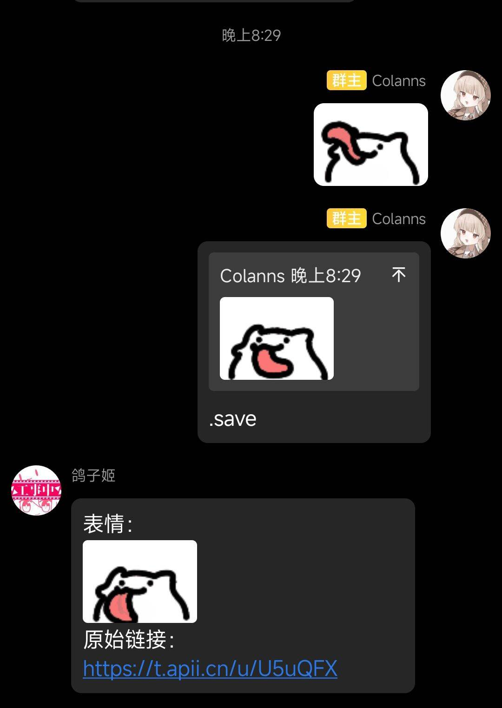

  
   
  

# nonebot-plugin-sticker-saver

_✨ 一款很简单的，用于保存已经不提供保存选项的 QQ 表情包的 Nonebot 插件 ✨_

## 📖 介绍

一款很简单的用于保存表情包的 Nonebot 插件，无需任何配置，只需以 `.save` 命令回复表情包即可。

机器人回复的静态表情可以直接保存，动态表情可以通过短链接保存。

如果想要替换短链接 API，请修改代码第 20 行及以后部分。

## 💿 安装

使用 nb-cli 安装

在 nonebot2 项目的根目录下打开命令行, 输入以下指令即可安装

    nb plugin install nonebot-plugin-sticker-saver

使用包管理器安装

在 nonebot2 项目的插件目录下, 打开命令行, 根据你使用的包管理器, 输入相应的安装命令

pip

    pip install nonebot-plugin-sticker-saver

pdm

    pdm add nonebot-plugin-sticker-saver

poetry

    poetry add nonebot-plugin-sticker-saver

conda

    conda install nonebot-plugin-sticker-saver

打开 nonebot2 项目根目录下的 `pyproject.toml` 文件, 在 `[tool.nonebot]` 部分追加写入

    plugins = ["nonebot_plugin_sticker_saver"]

## 🎉 使用方式
### 指令表
| 指令 | 权限 | 需要@ | 范围 | 说明 |
|:-----:|:----:|:----:|:----:|:----:|
| save / 保存图片 / 保存表情 / 保存 | 无 | 否 | 私聊 / 群聊 | 通过回复消息来获取表情包文件和链接 |
### 效果图

